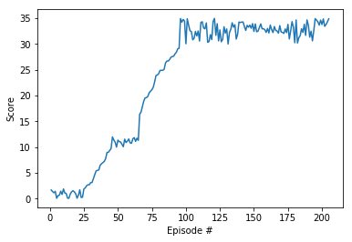

# Introduction 

The task is to create an agent that is able to move to a target location controlling a double jionted arm. A reward of +0.1 is provided for each statp that the agent's hand is in the goal location.
The objectif is to maintain position at the target location for as many time steps as possible.

The agent have to predict a vector of four continuous actions between [-1,1].
The observations space is a vector of 33 variables corresponding to position, rotation, velocity and angular velocities.

We choose to work with the first version of the environnment with 1 agent. The task is to get an average score of +30 over 100 consecutive episodes. To do this, we choose to to work with a deep deterministic policy gradient.

# Dependencies

You need to install the environnement, put it at the root of the folder and call like this:

env = UnityEnvironment(file_name="/Reacher_Linux_NoVis/Reacher.x86_64'")

You can download the environement for linux here:
https://s3-us-west-1.amazonaws.com/udacity-drlnd/P2/Reacher/one_agent/Reacher_Linux_NoVis.zip

# Run

You just have to run the file main.py to launch the training of the agent.

## Implementation
### DDPG
This is an actor critic method architecture

Actor architecture:
  * Fully connected 128
  * Fully connected 128
  * Output 4 continuous values between -1,1
  
Critic architecture:
  * Fully connected 128 + concatenate actions vector
  * Fully connected 128
  * Fully connected 128
  * Output 1 value
  
We update the network 10 times every 20 steps

The environment is solved in 202 episodes:

# Improvement

The main improvement is to implement an a3C method or a ppo.
An a3c use a single brain for multiple agents. This is an online method which converge faster than the ddpg ans don't use sampling.
Policy Gradient method are really sensitive to the choosen parameter and to the sampling efficiency. The PPO make use of the ratio of probability under new and old policy to control the deviation between the old policy and enable multiple epochs of minibatch updates.
