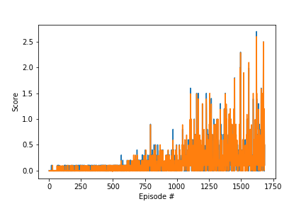

## Run
You just have to run the main.py to execute the code and calculate the solution.

## Implementation
### DDPG
The method implemented for this problem is a DDPG method. This is an actor critic method, which is particularly interesting for continuous actions space.
In this implementation, we use a prioritized experience replay in order ot select the experience based on the temporal difference error and accelerate the learning.
We solve the environment in 1654 episodes.  We used other improvement such as the fixed Q-target and soft-updates.

The learning is really faster with the experience replay, but i need to be more agressive with the learning and learn twice at each step.
Without this, the algorithm has some difficulties to converge.

I try to reduce the size of the network but it did not help. The results are  difficult to replicate.

## Improvements

An implementation of the PPO would really help for the convergence thanks to the gradient clipping and reward normalization.

The prioritized experience replay could be implemented with a binary tree in order to accelerate the sampling, instead of a simple numpy array.
